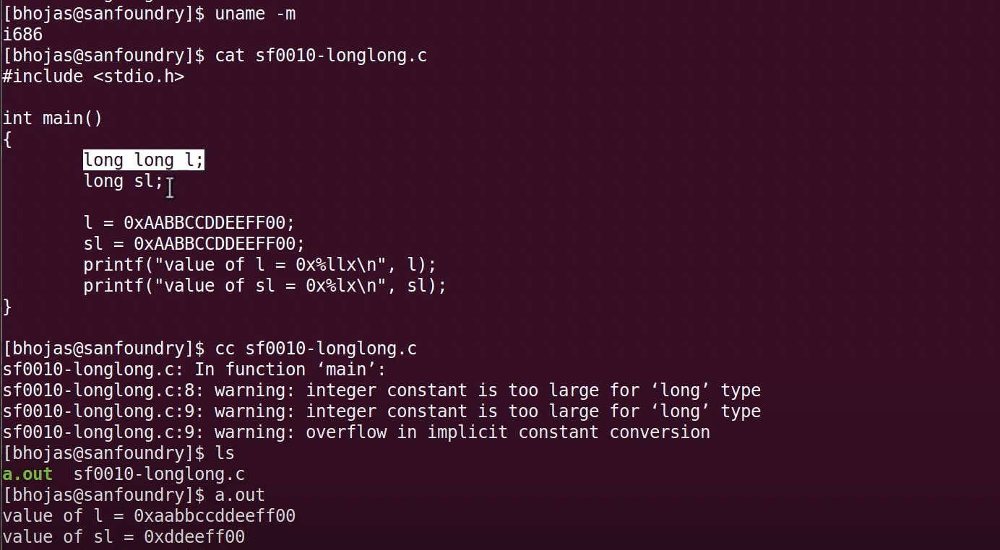

## C Data - Test1


## C Data - Test2

  

## C Data - Test3

  

## C Data Types

  


## C Data - Primitive Types

  

- `char` A represents 65 in ascii and 0100 0001 means 65 in bites
- `short`, `int`, `long` basically represents what is the range of value that you can store for each one of them in your programming environment
- `double` is a special situation in the earlier days because you wanted to store much more higher precision than float ex) 1.123456789
- `malloc` returns pointer and not particular data type value
  - ```zsh
    $ man malloc
    void *malloc(size_t size);
    ```
  - type cast ex) `char *p = (char *)malloc(50);`

## C Data - Test1 - Explanation

  

## C Data - Test2 - Explanation

  

- `int` is >=2 bytes
- controllers, processor, they don't understand negative number for their input functions

## C Data - Test3 - Explanation

  

- ```zsh
   $ man strlen
   size_t strlen(const char *s);
   ```

## C Data - User Defined Types

  

  

- `Union`, the total memory allocated for particular Union will be the memory required for the biggest member or biggest field of particular Union

## Long vs Long Long Data type in 32-bit system

  

  

## C Data - Derived or Dependent Types

  
