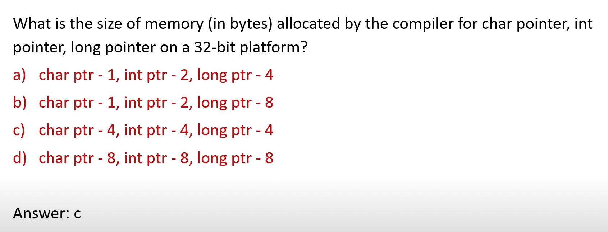

## C Data Type - Test1

  

- depends on computer architecture

## C Data Type - Test2

  

## C Data Type - Test3

  

## C Data Type - Test4

  

## C Data Type - Test5

  

## C Data Type - Test6

  

## C Data Type - Test7

  

## Memory Allocation - ?

  

## Memory Allocation - Primitive Data Types

  

## List of Primitive Data Types(32-bit)

  

  

## Memory Allocation - 32-bit vs 64-bit Systems

  

- `long` is 4 bytes in 32-bit and 8 bytes in 64-bit
- `long long` is just `long` in a 64-bit and is an 8 bytes

## Data-Type Sizes(1)

  

`x86_64`
  

- `size of c = 1, 1`
- `size of cp = 8, 1, 8`
  - on a 64-bit addresses are 8 byte
  - `cp` stores an address
  - `*cp` saying is if you jump into that location tell me the size of the data which is going to be stored there
- `size of s = 2, 2`
- `size of sp = 8, 2, 8`
- `size of i = 4, 4`
- `size of l = 8, 8`
- `size of f = 4, 4`
- `size of df = 8, 8`
- `variable or field 'v' declared void`
  - `void v, *vp;`
- `size of vp = 8, 8`
- `size of v = 1`
  - don't assume that the size of void is 1
- `4, 4, 8`
  - 100 --> Numerical value: integer
  - 0x FF FF FF FF --> 1 byte x 4 = 4 bytes
  - 0x FF FF FF FF FF --> 1 byte x 5 = 5 bytes => 8

  

  
